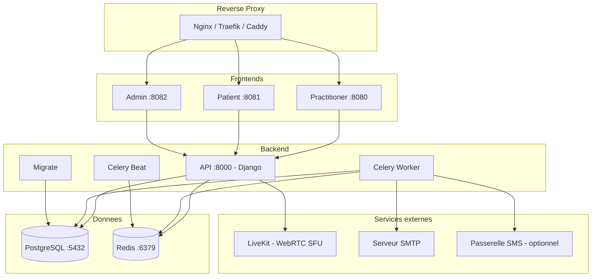

# Deploiement avec Docker Compose

Cette methode deploie l'ensemble des services HCW@Home dans des conteneurs Docker. C'est l'approche recommandee pour le developpement, les tests et les environnements cloud.

## Prerequis

- Docker Engine 20+ et Docker Compose v2
- 2 Go de RAM minimum
- Un nom de domaine (production) ou `localhost` (developpement)

## Architecture des services



## Mise en place rapide

### 1. Cloner le depot

```bash
git clone https://github.com/HCW-home/hcw-home.git
cd hcw-home
```

### 2. Configurer l'environnement

Copier le fichier de configuration :

```bash
cp backend/.env-dist backend/.env
```

Editer `backend/.env` avec vos parametres. Les variables essentielles :

```ini
# Securite - OBLIGATOIRE : changez cette cle en production
DJANGOSECRET_KEY=votre-cle-secrete-aleatoire

# Domaines autorises
ALLOWED_HOST=votre-domaine.com
CSRF_TRUSTED_ORIGINS=https://votre-domaine.com

# Desactiver le mode debug en production
DEBUG=False

# Email (pour les invitations et rappels)
EMAIL_HOST=smtp.example.com
EMAIL_PORT=587
DEFAULT_FROM_EMAIL=noreply@example.com

# Chiffrement des donnees sensibles
ENCRYPTION_KEY=votre-cle-sha256
```

!!! warning "Securite"
    Ne jamais utiliser les valeurs par defaut de `DJANGOSECRET_KEY` et `ENCRYPTION_KEY` en production. Generez une cle avec : `echo -n "votre phrase secrete" | sha256sum`

### 3. Lancer les services

```bash
docker compose up -d
```

Au premier lancement, le service `migrate` applique automatiquement les migrations de base de donnees.

### 4. Creer un tenant

HCW@Home utilise le multi-tenancy avec isolation par schema PostgreSQL. Chaque tenant possede ses propres donnees, utilisateurs et configuration. Les tenants sont crees via le shell Django.

```bash
docker compose exec api python manage.py shell
```

```python
from django_tenants.utils import schema_context
from constance import config

# Choisir un nom de tenant (utilise comme nom de schema PostgreSQL)
tenant_name = 'montenant'

# Creer le tenant
tenant = Tenant(schema_name=tenant_name, name='Mon Organisation')
tenant.save()

# Enregistrer les domaines (portail praticien, portail patient, admin)
Domain.objects.create(domain=f'{tenant_name}.portal.example.com', tenant=tenant)
Domain.objects.create(domain=f'{tenant_name}.consult.example.com', tenant=tenant)
Domain.objects.create(domain=f'{tenant_name}.connect.example.com', tenant=tenant)

# Creer un super-utilisateur, un serveur media et un fournisseur de messagerie dans le tenant
with schema_context(tenant_name):
    User.objects.create_superuser('admin@example.com', 'votre-mot-de-passe')
    Server.objects.create(
        url="https://livekit.example.com",
        api_token="votre-cle-api",
        api_secret="votre-secret-api",
    )
    MessagingProvider.objects.create(name='email', from_email="noreply@example.com")

# Configurer les URLs des frontends pour le tenant
with schema_context(tenant_name):
    config.patient_base_url = f'https://{tenant_name}.consult.example.com'
    config.practitioner_base_url = f'https://{tenant_name}.connect.example.com'
```

!!! tip "Plusieurs tenants"
    Repetez ce processus pour chaque organisation. Chaque tenant est completement isole : utilisateurs, consultations, configuration et branding separes.

### 5. Charger les donnees de test (optionnel)

```bash
docker compose exec api python manage.py loaddata initial/TestData.json
```

Cela cree des utilisateurs de test (mot de passe : `Test1234`). Voir le [README](https://github.com/HCW-home/hcw-home) pour la liste complete.

## Services et ports

| Service | Port expose | Description |
|---------|-------------|-------------|
| **practitioner** | 8080 | Interface praticien (Angular) |
| **patient** | 8081 | Interface patient (Ionic) |
| **admin** | 8082 | Interface d'administration Django |
| **api** | interne | API REST + WebSocket (Daphne) |
| **celery** | - | Worker pour les taches asynchrones |
| **scheduler** | - | Planificateur de taches (Celery Beat) |
| **db** | interne | PostgreSQL 15 |
| **redis** | interne | Redis 7 |

## Volumes persistants

Les donnees sont stockees dans le dossier `./data/` :

| Chemin | Contenu |
|--------|---------|
| `./data/postgres_data/` | Donnees PostgreSQL |
| `./data/redis_data/` | Donnees Redis |

## Variables d'environnement

### Configuration minimale

| Variable | Defaut | Description |
|----------|--------|-------------|
| `DJANGOSECRET_KEY` | - | Cle secrete Django (obligatoire) |
| `ALLOWED_HOST` | `127.0.0.1` | Hote autorise |
| `CSRF_TRUSTED_ORIGINS` | `http://127.0.0.1` | Origines CSRF de confiance |
| `DEBUG` | `True` | Mode debug |
| `DATABASE_NAME` | `hcw` | Nom de la base de donnees |
| `DATABASE_USER` | `hcw` | Utilisateur PostgreSQL |
| `DATABASE_PASSWORD` | `hcw` | Mot de passe PostgreSQL |
| `DATABASE_HOST` | `127.0.0.1` | Hote PostgreSQL |
| `REDIS_HOST` | `127.0.0.1` | Hote Redis |

### Email

| Variable | Defaut | Description |
|----------|--------|-------------|
| `EMAIL_HOST` | `127.0.0.1` | Serveur SMTP |
| `EMAIL_PORT` | `25` | Port SMTP |
| `DEFAULT_FROM_EMAIL` | `info@hcw-at-home.com` | Adresse d'envoi |

### Stockage S3 (optionnel)

| Variable | Description |
|----------|-------------|
| `S3_BUCKET_NAME` | Nom du bucket S3 |
| `S3_ENDPOINT_URL` | URL du service S3 (MinIO, AWS, etc.) |
| `S3_ACCESS_KEY` | Cle d'acces S3 |
| `S3_SECRET_KEY` | Cle secrete S3 |

### LiveKit - Enregistrement video (optionnel)

| Variable | Description |
|----------|-------------|
| `LIVEKIT_S3_BUCKET_NAME` | Bucket pour les enregistrements |
| `LIVEKIT_S3_ENDPOINT_URL` | URL du service S3 |
| `LIVEKIT_S3_ACCESS_KEY` | Cle d'acces |
| `LIVEKIT_S3_SECRET_KEY` | Cle secrete |
| `LIVEKIT_S3_REGION` | Region (defaut : `us-east-1`) |

### OpenID Connect (optionnel)

| Variable | Description |
|----------|-------------|
| `OPENID_NAME` | Nom du fournisseur (affiche a l'utilisateur) |
| `OPENID_CLIENT_ID` | Client ID |
| `OPENID_SECRET` | Client secret |
| `OPENID_CONFIGURATION_URL` | URL de decouverte OpenID (.well-known) |

### Notifications push (optionnel)

| Variable | Description |
|----------|-------------|
| `WEBPUSH_VAPID_PRIVATE_KEY` | Cle privee VAPID |
| `WEBPUSH_VAPID_PUBLIC_KEY` | Cle publique VAPID |
| `WEBPUSH_VAPID_CLAIMS_EMAIL` | Email de contact VAPID |

## Reverse proxy en production

En production, placez un reverse proxy (Nginx, Traefik, Caddy) devant les services pour :

- Terminer le TLS/SSL
- Router les domaines vers les bons services
- Gerer les WebSockets

Exemple de configuration Nginx :

```nginx
# Practitioner
server {
    listen 443 ssl;
    server_name app.example.com;

    ssl_certificate /etc/ssl/certs/example.com.pem;
    ssl_certificate_key /etc/ssl/private/example.com.key;

    location / {
        proxy_pass http://127.0.0.1:8080;
        proxy_set_header Host $host;
        proxy_set_header X-Forwarded-Proto $scheme;
    }

    # WebSocket support
    location /ws/ {
        proxy_pass http://127.0.0.1:8080;
        proxy_http_version 1.1;
        proxy_set_header Upgrade $http_upgrade;
        proxy_set_header Connection "upgrade";
        proxy_set_header Host $host;
    }
}

# Patient
server {
    listen 443 ssl;
    server_name patient.example.com;

    ssl_certificate /etc/ssl/certs/example.com.pem;
    ssl_certificate_key /etc/ssl/private/example.com.key;

    location / {
        proxy_pass http://127.0.0.1:8081;
        proxy_set_header Host $host;
        proxy_set_header X-Forwarded-Proto $scheme;
    }

    location /ws/ {
        proxy_pass http://127.0.0.1:8081;
        proxy_http_version 1.1;
        proxy_set_header Upgrade $http_upgrade;
        proxy_set_header Connection "upgrade";
        proxy_set_header Host $host;
    }
}

# Admin
server {
    listen 443 ssl;
    server_name admin.example.com;

    ssl_certificate /etc/ssl/certs/example.com.pem;
    ssl_certificate_key /etc/ssl/private/example.com.key;

    location / {
        proxy_pass http://127.0.0.1:8082;
        proxy_set_header Host $host;
        proxy_set_header X-Forwarded-Proto $scheme;
    }
}
```

## Utiliser des images pre-construites

Les images Docker sont disponibles sur le registre :

```yaml
services:
  api:
    image: docker.io/iabsis/hcw6-backend:latest
  admin:
    image: docker.io/iabsis/hcw6-admin:latest
  patient:
    image: docker.io/iabsis/hcw6-patient:latest
  practitioner:
    image: docker.io/iabsis/hcw6-practitioner:latest
```

Pour utiliser une version specifique, remplacez `latest` par le tag souhaite :

```bash
TAG=1.0.0 docker compose up -d
```

## Commandes utiles

```bash
# Voir les logs
docker compose logs -f api

# Appliquer les migrations manuellement
docker compose exec api python manage.py migrate

# Creer un super-utilisateur
docker compose exec api python manage.py createsuperuser

# Collecter les fichiers statiques
docker compose exec api python manage.py collectstatic --noinput

# Redemarrer un service
docker compose restart api

# Arreter tous les services
docker compose down

# Arreter et supprimer les volumes (ATTENTION : perte de donnees)
docker compose down -v
```
