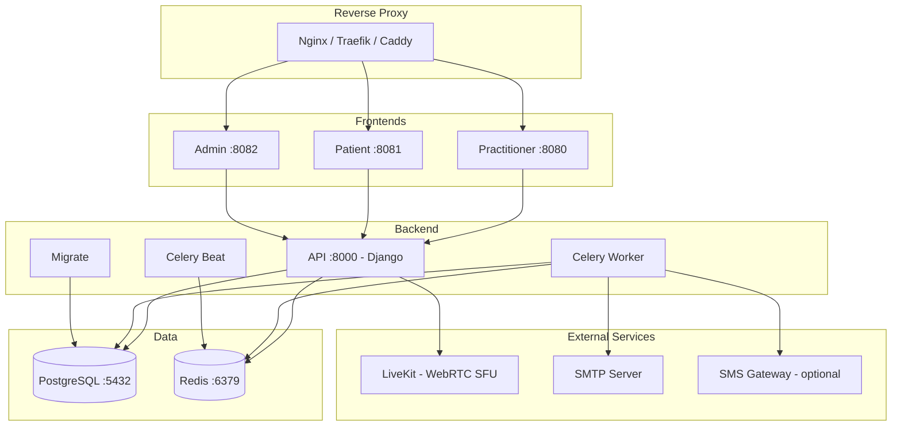

# Deployment with Docker Compose

This method deploys all HCW@Home services in Docker containers. It is the recommended approach for development, testing, and cloud environments.

## Prerequisites

- Docker Engine 20+ and Docker Compose v2
- Minimum 2 GB RAM
- A domain name (production) or `localhost` (development)

## Service Architecture



## Quick Start

### 1. Clone the repository

```bash
git clone https://github.com/HCW-home/hcw-home.git
cd hcw-home
```

### 2. Configure the environment

Copy the configuration file:

```bash
cp backend/.env-dist backend/.env
```

Edit `backend/.env` with your settings. Essential variables:

```ini
# Security - REQUIRED: change this key in production
DJANGOSECRET_KEY=your-random-secret-key

# Allowed domains
ALLOWED_HOST=your-domain.com
CSRF_TRUSTED_ORIGINS=https://your-domain.com

# Disable debug mode in production
DEBUG=False

# Email (for invitations and reminders)
EMAIL_HOST=smtp.example.com
EMAIL_PORT=587
DEFAULT_FROM_EMAIL=noreply@example.com

# Sensitive data encryption
ENCRYPTION_KEY=your-sha256-key
```

!!! warning "Security"
    Never use the default values for `DJANGOSECRET_KEY` and `ENCRYPTION_KEY` in production. Generate a key with: `echo -n "your secret phrase" | sha256sum`

### 3. Start the services

```bash
docker compose up -d
```

On first launch, the `migrate` service automatically applies database migrations.

### 4. Create a tenant

HCW@Home uses multi-tenancy with PostgreSQL schema isolation. Each tenant has its own data, users, and configuration. Tenants are created via the Django shell.

```bash
docker compose exec api python manage.py shell
```

```python
from messaging.models import MessagingProvider
from django_tenants.utils import schema_context
from constance import config

# Choose a tenant name (used as PostgreSQL schema name)
tenant_name = 'mytenant'

# Create the tenant
tenant = Tenant(schema_name=tenant_name, name='My Organization')
tenant.save()

# Register the domains (practitioner portal, patient portal, admin)
Domain.objects.create(domain=f'{tenant_name}.portal.example.com', tenant=tenant)
Domain.objects.create(domain=f'{tenant_name}.consult.example.com', tenant=tenant)
Domain.objects.create(domain=f'{tenant_name}.connect.example.com', tenant=tenant)

# Create a superuser, media server, and messaging provider inside the tenant
with schema_context(tenant_name):
    User.objects.create_superuser('admin@example.com', 'your-password')
    Server.objects.create(
        url="https://livekit.example.com",
        api_token="your-api-key",
        api_secret="your-api-secret",
    )
    MessagingProvider.objects.create(name='email', from_email="noreply@example.com")

# Configure frontend URLs for the tenant
with schema_context(tenant_name):
    config.patient_base_url = f'https://{tenant_name}.consult.example.com'
    config.practitioner_base_url = f'https://{tenant_name}.connect.example.com'
```

!!! tip "Multiple tenants"
    Repeat this process for each organization. Each tenant is fully isolated: separate users, consultations, configuration, and branding.

### 5. Load test data (optional)

```bash
docker compose exec api python manage.py loaddata initial/TestData.json
```

This creates test users (password: `Test1234`). See the [README](https://github.com/HCW-home/hcw-home) for the full list.

## Services and Ports

| Service | Exposed Port | Description |
|---------|-------------|-------------|
| **practitioner** | 8080 | Practitioner interface (Angular) |
| **patient** | 8081 | Patient interface (Ionic) |
| **admin** | 8082 | Django admin interface |
| **api** | internal | REST API + WebSocket (Daphne) |
| **celery** | - | Asynchronous task worker |
| **scheduler** | - | Task scheduler (Celery Beat) |
| **db** | internal | PostgreSQL 15 |
| **redis** | internal | Redis 7 |

## Persistent Volumes

Data is stored in the `./data/` directory:

| Path | Content |
|------|---------|
| `./data/postgres_data/` | PostgreSQL data |
| `./data/redis_data/` | Redis data |

## Environment Variables

### Minimal Configuration

| Variable | Default | Description |
|----------|---------|-------------|
| `DJANGOSECRET_KEY` | - | Django secret key (required) |
| `ALLOWED_HOST` | `127.0.0.1` | Allowed host |
| `CSRF_TRUSTED_ORIGINS` | `http://127.0.0.1` | Trusted CSRF origins |
| `DEBUG` | `True` | Debug mode |
| `DATABASE_NAME` | `hcw` | Database name |
| `DATABASE_USER` | `hcw` | PostgreSQL user |
| `DATABASE_PASSWORD` | `hcw` | PostgreSQL password |
| `DATABASE_HOST` | `127.0.0.1` | PostgreSQL host |
| `REDIS_HOST` | `127.0.0.1` | Redis host |

### Email

| Variable | Default | Description |
|----------|---------|-------------|
| `EMAIL_HOST` | `127.0.0.1` | SMTP server |
| `EMAIL_PORT` | `25` | SMTP port |
| `DEFAULT_FROM_EMAIL` | `info@hcw-at-home.com` | Sender address |

### S3 Storage (optional)

| Variable | Description |
|----------|-------------|
| `S3_BUCKET_NAME` | S3 bucket name |
| `S3_ENDPOINT_URL` | S3 service URL (MinIO, AWS, etc.) |
| `S3_ACCESS_KEY` | S3 access key |
| `S3_SECRET_KEY` | S3 secret key |

### LiveKit - Video Recording (optional)

| Variable | Description |
|----------|-------------|
| `LIVEKIT_S3_BUCKET_NAME` | Bucket for recordings |
| `LIVEKIT_S3_ENDPOINT_URL` | S3 service URL |
| `LIVEKIT_S3_ACCESS_KEY` | Access key |
| `LIVEKIT_S3_SECRET_KEY` | Secret key |
| `LIVEKIT_S3_REGION` | Region (default: `us-east-1`) |

### OpenID Connect (optional)

| Variable | Description |
|----------|-------------|
| `OPENID_NAME` | Provider name (displayed to user) |
| `OPENID_CLIENT_ID` | Client ID |
| `OPENID_SECRET` | Client secret |
| `OPENID_CONFIGURATION_URL` | OpenID discovery URL (.well-known) |

### Push Notifications (optional)

| Variable | Description |
|----------|-------------|
| `WEBPUSH_VAPID_PRIVATE_KEY` | VAPID private key |
| `WEBPUSH_VAPID_PUBLIC_KEY` | VAPID public key |
| `WEBPUSH_VAPID_CLAIMS_EMAIL` | VAPID contact email |

## Reverse Proxy in Production

In production, place a reverse proxy (Nginx, Traefik, Caddy) in front of the services to:

- Terminate TLS/SSL
- Route domains to the correct services
- Handle WebSockets

Nginx configuration example:

```nginx
# Practitioner
server {
    listen 443 ssl;
    server_name app.example.com;

    ssl_certificate /etc/ssl/certs/example.com.pem;
    ssl_certificate_key /etc/ssl/private/example.com.key;

    location / {
        proxy_pass http://127.0.0.1:8080;
        proxy_set_header Host $host;
        proxy_set_header X-Forwarded-Proto $scheme;
    }

    # WebSocket support
    location /ws/ {
        proxy_pass http://127.0.0.1:8080;
        proxy_http_version 1.1;
        proxy_set_header Upgrade $http_upgrade;
        proxy_set_header Connection "upgrade";
        proxy_set_header Host $host;
    }
}

# Patient
server {
    listen 443 ssl;
    server_name patient.example.com;

    ssl_certificate /etc/ssl/certs/example.com.pem;
    ssl_certificate_key /etc/ssl/private/example.com.key;

    location / {
        proxy_pass http://127.0.0.1:8081;
        proxy_set_header Host $host;
        proxy_set_header X-Forwarded-Proto $scheme;
    }

    location /ws/ {
        proxy_pass http://127.0.0.1:8081;
        proxy_http_version 1.1;
        proxy_set_header Upgrade $http_upgrade;
        proxy_set_header Connection "upgrade";
        proxy_set_header Host $host;
    }
}

# Admin
server {
    listen 443 ssl;
    server_name admin.example.com;

    ssl_certificate /etc/ssl/certs/example.com.pem;
    ssl_certificate_key /etc/ssl/private/example.com.key;

    location / {
        proxy_pass http://127.0.0.1:8082;
        proxy_set_header Host $host;
        proxy_set_header X-Forwarded-Proto $scheme;
    }
}
```

## Using Pre-built Images

Docker images are available on the registry:

```yaml
services:
  api:
    image: docker.io/iabsis/hcw6-backend:latest
  admin:
    image: docker.io/iabsis/hcw6-admin:latest
  patient:
    image: docker.io/iabsis/hcw6-patient:latest
  practitioner:
    image: docker.io/iabsis/hcw6-practitioner:latest
```

To use a specific version, replace `latest` with the desired tag:

```bash
TAG=1.0.0 docker compose up -d
```

## Useful Commands

```bash
# View logs
docker compose logs -f api

# Manually apply migrations
docker compose exec api python manage.py migrate

# Create a super user
docker compose exec api python manage.py createsuperuser

# Collect static files
docker compose exec api python manage.py collectstatic --noinput

# Restart a service
docker compose restart api

# Stop all services
docker compose down

# Stop and remove volumes (WARNING: data loss)
docker compose down -v
```
